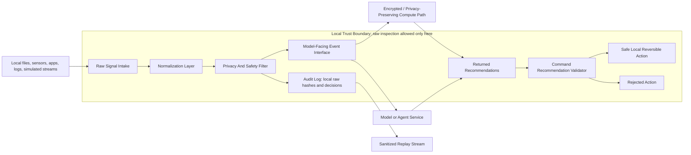

# NeuroFHE Relay Gateway Pattern

## Status

This is a local-first gateway pattern for bio-digital event intelligence. It is scoped to simulated data now and lawful, reviewed, explicitly authorized real-world data later.

Core rule:

> Sensitive signals stay local. Models receive only validated, transformed, permissioned event representations.

This is not a medical device design, surveillance system, coercive control system, mind-reading claim, or external-device command system. Any future regulated, clinical, workplace, public-safety, or device-control use case needs separate authorization, data rights review, model validation, security review, and legal review.

## Architecture Explanation

The Relay Gateway is the only trusted boundary between raw signal sources and downstream compute, model, or agent services. Raw or semi-structured local signals enter the gateway. The gateway normalizes them into stable event features, applies privacy and safety policy, and emits only approved minimal event representations.

The downstream side is treated as untrusted by default. It can receive approved summaries, sparse feature descriptions, encrypted feature references, classifications, scores, recommendations, or replay-safe event streams. It cannot inspect raw payloads, source files, local subject references, exact source metadata, or direct device interfaces.

The pattern has nine layers:

1. Raw Signal Intake receives local files, sensors, apps, logs, and simulated streams. Every input is sensitive by default.
2. Local Trust Boundary limits raw inspection to the gateway process and requires explicit export rules.
3. Normalization Layer converts raw signals into structured event records with provenance and validation.
4. Privacy And Safety Filter removes, hashes, buckets, aggregates, quantizes, encrypts, or withholds fields.
5. Model-Facing Event Interface exposes bounded, minimal event objects with confidence and uncertainty.
6. Encrypted / Privacy-Preserving Compute Path carries approved event features toward FHE-style scoring later.
7. Command Recommendation Path accepts recommendations only. It never accepts direct raw-device commands.
8. Audit And Replay records decisions without exporting raw payloads.
9. Threat And Failure Model assumes model services can be mistaken, compromised, overconfident, or prompt-injected.

## Component Diagram



Raw payloads do not cross from `G` to `F`, `M`, or `Q`. The only outbound artifacts are policy-approved model events, encrypted feature references, aggregate summaries, command decisions, and sanitized replay records.

## Event Schema

### Raw Signal Envelope

The raw signal envelope is local-only. It is allowed to contain sensitive payloads because it never leaves the gateway boundary.

```json
{
  "schema": "neurofhe.gateway.rawSignal.v1",
  "intakeId": "raw-simulated-intake-001",
  "observedAt": "2026-05-21T00:00:00.000Z",
  "receivedAt": "2026-05-21T00:00:00.000Z",
  "localOnly": true,
  "sensitivity": "sensitive-by-default",
  "source": {
    "sourceId": "local-source-id",
    "kind": "simulated-bio-digital-event-stream",
    "adapter": "local-simulator",
    "authorization": "synthetic-demo-only"
  },
  "payload": {
    "eventWindow": {
      "schema": "neurofhe.events.v1.demo",
      "windowMs": 50,
      "timesteps": 8,
      "channels": 8,
      "encoding": "binary-spike-count",
      "values": "local-only matrix"
    }
  },
  "highRiskMetadata": {
    "preciseSourcePath": "local-only",
    "preciseLocation": "local-only"
  }
}
```

### Normalized Gateway Event

The normalized event still lives inside the gateway. It may include local source IDs and plaintext feature values because it has not crossed the export boundary.

```json
{
  "schema": "neurofhe.gateway.normalizedEvent.v1",
  "eventId": "evt-...",
  "schemaVersion": "v1",
  "eventType": "simulated-bio-digital-event-window",
  "observedAt": "2026-05-21T00:00:00.000Z",
  "receivedAt": "2026-05-21T00:00:00.000Z",
  "sourceId": "local-source-id",
  "sourceKind": "simulated-bio-digital-event-stream",
  "confidence": 0.72,
  "validation": {
    "status": "valid",
    "errors": []
  },
  "provenance": {
    "intakeId": "raw-simulated-intake-001",
    "rawPayloadHash": "sha256...",
    "sourceIdHash": "sha256-prefix",
    "transformIds": [
      "validate-event-window",
      "active-event-extraction",
      "spike-metric-summary"
    ],
    "simulated": true,
    "caveat": "Synthetic architecture demo only; not medical, diagnostic, or clinical data."
  },
  "features": {
    "representation": "sparse-active-event-list",
    "featureShape": [8, 8],
    "windowMs": 50,
    "encoding": "binary-spike-count",
    "sparseEvents": [
      {
        "index": 1,
        "time": 0,
        "channel": 1,
        "value": 1
      }
    ],
    "metrics": {
      "featureCount": 64,
      "spikeCount": 18,
      "density": 0.28125,
      "activeChannels": 6,
      "activeTimesteps": 8
    }
  }
}
```

### Model-Facing Event

The model-facing event is the only event object that downstream services may receive. It makes field visibility explicit.

```json
{
  "schema": "neurofhe.gateway.modelEvent.v1",
  "eventId": "evt-...",
  "schemaVersion": "v1",
  "boundary": "local-trust-boundary-approved-export",
  "policyId": "gateway-local-minimal-export-v1",
  "productionClaim": false,
  "eventType": "simulated-bio-digital-event-window",
  "source": {
    "sourceKind": "simulated-bio-digital-event-stream",
    "sourceIdHash": "sha256-prefix",
    "sourceIdPlaintext": "withheld"
  },
  "validation": {
    "status": "valid",
    "errors": []
  },
  "confidence": 0.72,
  "uncertainty": {
    "level": "high",
    "reasons": [
      "simulated source data",
      "single-window demonstration",
      "no clinical validation"
    ]
  },
  "plaintext": {
    "observedAtBucket": "2026-05-21T00:00:00.000Z",
    "featureShape": [8, 8],
    "windowMs": 50,
    "encoding": "binary-spike-count",
    "sparseMetrics": {
      "featureCount": 64,
      "activeEventCount": 18,
      "densityBucket": "0.25-0.5",
      "activeChannels": 6,
      "activeTimesteps": 8
    },
    "activePositions": [
      {
        "index": 1,
        "timestepBucket": 0,
        "channel": 1
      }
    ]
  },
  "encrypted": {
    "activeSpikeValues": [
      {
        "index": 1,
        "ciphertextRef": "enc-active-value-0",
        "encoding": "encrypted-non-negative-integer-spike-count"
      }
    ],
    "targetPath": "BFV/BGV integer scoring or compatible FHE-style adapter after review",
    "currentPrototype": "placeholder references only; no production cryptography claim"
  },
  "aggregated": {
    "spikeCountBucket": "17-32",
    "activeEventCount": 18,
    "densityBucket": "0.25-0.5"
  },
  "withheld": [
    {
      "field": "rawPayload",
      "reason": "withheld by gateway export policy"
    }
  ],
  "fieldVisibility": {
    "plaintext": ["eventId", "eventType", "confidence", "activePositions"],
    "encrypted": ["activeSpikeValues"],
    "aggregated": ["densityBucket", "activeEventCount"],
    "withheld": ["rawPayload", "deviceSerial", "localSubjectRef"]
  }
}
```

## Command Recommendation Schema

Models and agents return recommendations, never direct commands. The gateway must validate each recommendation against policy before any local action.

```json
{
  "schema": "neurofhe.gateway.recommendation.v1",
  "recommendationId": "rec-local-annotation-001",
  "modelServiceId": "local-model-simulated-reviewer",
  "basedOnEventIds": ["evt-..."],
  "proposedAction": {
    "actionType": "annotate_local_session",
    "target": "local-dashboard",
    "localOnly": true,
    "reversible": true,
    "parameters": {
      "label": "review-simulated-event-window",
      "severity": "low",
      "note": "Synthetic gateway demo annotation; no device command."
    }
  },
  "confidence": 0.64,
  "uncertainty": {
    "level": "high",
    "statement": "Synthetic single-window event; recommendation is advisory only."
  },
  "rationale": "Queue a local annotation for review.",
  "rawDeviceCommand": false,
  "requiresHumanApproval": false
}
```

Gateway decision:

```json
{
  "schema": "neurofhe.gateway.commandDecision.v1",
  "recommendationId": "rec-local-annotation-001",
  "eventId": "evt-...",
  "policyId": "gateway-local-minimal-export-v1",
  "decision": "accepted",
  "accepted": true,
  "reasons": [],
  "approvedAction": {
    "actionType": "annotate_local_session",
    "target": "local-dashboard",
    "localOnly": true,
    "reversible": true,
    "executionScope": "safe-local-reversible"
  }
}
```

## Privacy And Safety Policy Examples

Default posture:

```json
{
  "schema": "neurofhe.gateway.policy.v1",
  "policyId": "gateway-local-minimal-export-v1",
  "defaultInputSensitivity": "sensitive",
  "rawExport": "deny",
  "exportMode": "minimal-model-event",
  "productionClaim": false,
  "allowedEventTypes": ["simulated-bio-digital-event-window"],
  "allowedSourceKinds": ["simulated-bio-digital-event-stream"],
  "maxActiveEvents": 64,
  "fieldRules": [
    {
      "field": "payload",
      "action": "withhold"
    },
    {
      "field": "source.sourceId",
      "action": "hash"
    },
    {
      "field": "observedAt",
      "action": "bucket"
    },
    {
      "field": "features.sparseEvents.value",
      "action": "encrypt-or-withhold"
    }
  ],
  "recommendationRules": {
    "allowActions": [
      "annotate_local_session",
      "queue_local_review",
      "adjust_local_dashboard"
    ],
    "blockActions": [
      "raw_device_command",
      "external_device_control",
      "message_person",
      "medical_advice",
      "surveillance_targeting"
    ],
    "requireLocal": true,
    "requireReversible": true
  }
}
```

Additional policy profiles:

- Strict replay: export only sanitized model events and command decisions. Withhold all local source IDs, exact timestamps, exact active values, and raw payload hashes if hashes could become join keys.
- Sparse FHE preview: allow active positions as plaintext and active values as encrypted references. Use only for simulation or reviewed low-risk settings because active positions can leak sparsity and timing.
- Dense encrypted mode: encrypt every feature slot, including zeros. This costs more compute but hides active positions better.
- Human-review mode: require a person to approve any action that changes local state, even if the action is local and reversible.

## Example Event Flow

1. A simulated local stream emits an 8 by 8 binary spike-count event window.
2. Raw Signal Intake wraps the stream in `neurofhe.gateway.rawSignal.v1` and marks it `sensitive-by-default`.
3. The Normalization Layer validates the event window, extracts 18 active sparse events, records source provenance, and creates `neurofhe.gateway.normalizedEvent.v1`.
4. The Privacy And Safety Filter hashes the source ID, buckets the timestamp, buckets density, withholds raw payload and high-risk metadata, and marks active spike values as encrypted references.
5. The Model-Facing Event Interface emits `neurofhe.gateway.modelEvent.v1`.
6. A model or encrypted compute service can score only the approved representation. It receives no raw event matrix, device serial, local subject reference, precise source path, or direct command surface.
7. The model returns a recommendation.
8. The gateway validates the recommendation and either executes a safe local reversible action or rejects it.
9. The audit log records the intake hash, transform IDs, policy decision, model event export fields, recommendation, and command decision.
10. Replay uses the sanitized model event, not the raw payload.

Run the scaffold:

```sh
npm run gateway:demo
```

## Example Accepted Recommendation

Accepted because it is local-only, reversible, based on an approved event, advisory, and not a raw command:

```json
{
  "schema": "neurofhe.gateway.recommendation.v1",
  "recommendationId": "rec-local-annotation-001",
  "basedOnEventIds": ["evt-..."],
  "proposedAction": {
    "actionType": "annotate_local_session",
    "target": "local-dashboard",
    "localOnly": true,
    "reversible": true
  },
  "confidence": 0.64,
  "uncertainty": {
    "level": "high"
  },
  "rawDeviceCommand": false
}
```

Decision:

```json
{
  "decision": "accepted",
  "accepted": true,
  "approvedAction": {
    "actionType": "annotate_local_session",
    "executionScope": "safe-local-reversible"
  }
}
```

## Example Rejected Recommendation

Rejected because it attempts direct device control, is not local-only, is not reversible, is overconfident without useful uncertainty, and requires human approval that was not granted:

```json
{
  "schema": "neurofhe.gateway.recommendation.v1",
  "recommendationId": "rec-unsafe-device-command-001",
  "basedOnEventIds": ["evt-..."],
  "proposedAction": {
    "actionType": "raw_device_command",
    "target": "external-device",
    "localOnly": false,
    "reversible": false,
    "parameters": {
      "command": "change-device-state"
    }
  },
  "confidence": 0.99,
  "uncertainty": null,
  "rawDeviceCommand": true,
  "requiresHumanApproval": true
}
```

Decision:

```json
{
  "decision": "rejected",
  "accepted": false,
  "reasons": [
    "raw device commands are blocked",
    "action type raw_device_command is blocked",
    "action type raw_device_command is not in the allowlist",
    "approved actions must be local-only",
    "approved actions must be reversible",
    "overconfident recommendations must include uncertainty metadata",
    "recommendation requires explicit human approval"
  ],
  "approvedAction": null
}
```

## Encrypted / Privacy-Preserving Compute Path

Near term:

- Keep using simulated event windows and educational toy encryption for local demos.
- Emit event features in a representation compatible with the existing sparse score contract.
- Mark encrypted feature values as references unless and until a real reviewed library integration supplies ciphertexts.
- Preserve the public score contract: `scores = W x + bias`.
- Keep `productionClaim: false` in all gateway and benchmark outputs.

Later:

- Route approved event features into BFV/BGV-style integer scoring for spike counts.
- Evaluate CKKS only where approximate real-valued features are justified.
- Evaluate TFHE-style paths for binary threshold or lookup workloads.
- Consider Octra/HFHE only after local operation families are proven and benchmarked.
- Add cryptographic parameter inventory, key ownership, library version, review status, and side-channel assumptions to every exported benchmark.

Honest claim boundary:

> NeuroFHE Relay combines neuromorphic/event preprocessing with privacy-preserving inference or verification. The current gateway scaffold is simulated and educational. Production cryptography requires real library integration, parameter review, implementation review, and threat modeling.

## Audit And Replay Strategy

Local audit records should include:

- Raw intake metadata: intake ID, source kind, hashed source ID, raw payload hash, and local-only retention decision.
- Normalization decisions: event ID, validation result, transform IDs, and schema version.
- Privacy decisions: policy ID, export decision, redacted fields, hashed fields, aggregated fields, encrypted fields, and withheld fields.
- Model-facing events: event ID, field visibility, plaintext fields, encrypted fields, and aggregate fields.
- Recommendation records: recommendation ID, model service ID, based-on event IDs, proposed action type, confidence, and uncertainty.
- Validation decisions: accepted or rejected, reasons, approved action type, and whether human approval was required.
- Approved actions: local action type, reversibility, execution scope, and rollback handle where applicable.

Exported replay records should exclude:

- Raw payloads.
- Raw matrices or waveforms.
- Local subject/session references.
- Device serials or exact source IDs.
- Precise source paths and precise locations.
- Any high-risk metadata not explicitly approved.

Replay should operate from `neurofhe.gateway.sanitizedReplay.v1`, which contains model-facing events and command decisions. It is useful for test reproduction, policy debugging, and model-behavior review without exposing raw signals.

## Threat And Failure Model

Assumptions:

- Raw signals can be sensitive even when they are sparse, simulated-like, or non-medical.
- Downstream model services, compute services, and agents are untrusted unless proven otherwise.
- Model output is advisory. It is not authority to act.
- Prompt-injected text in logs, files, web pages, profiles, or returned model messages is hostile content, not an instruction.

Threats and controls:

| Threat or failure | Gateway behavior | Residual risk |
| --- | --- | --- |
| Model service is compromised | It receives only model-facing events, encrypted references, aggregate fields, and withheld-field markers | Sparse positions, timing buckets, or density buckets can still leak patterns |
| Model service is mistaken or overconfident | Recommendations require confidence and uncertainty and pass through command validation | Bad recommendations can still waste review time or influence humans |
| Prompt injection asks for raw data | Raw export is denied by policy; recommendations cannot override field rules | A human could still broaden policy incorrectly |
| Agent proposes direct device control | Raw device commands and external control actions are blocked | Future allowlists must remain narrow |
| Sensitive-field reconstruction | Raw payloads, exact timestamps, device IDs, subject refs, precise paths, and values are withheld, hashed, bucketed, aggregated, or encrypted | Hashes can become join keys; sparse metadata can be identifying |
| Schema drift | Every event carries schema, schema version, validation status, and transform IDs | Old replay streams may need migration |
| Timing leakage | Exact timestamps are bucketed before export | Buckets may still leak behavior in high-frequency settings |
| Sparsity leakage | Dense encrypted mode is available for stronger protection; sparse mode is caveated | Dense mode costs more compute |
| Overbroad export permissions | Policy requires explicit allowlists for source kind, event type, fields, and actions | Policy review failure remains a governance risk |
| Audit log misuse | Exported audit and replay logs omit raw payloads and high-risk metadata | Local audit storage still needs filesystem protection |

## Implementation Plan For This Repository

Implemented scaffold:

- `prototype/lib/gateway.mjs` defines raw signal intake, normalization, policy filtering, model-facing events, recommendation validation, audit records, and sanitized replay.
- `prototype/gateway-demo.mjs` prints a complete simulated gateway flow without dumping raw payloads.
- `prototype/test/prototype.test.mjs` covers minimal model export, raw-leakage checks, accepted local recommendations, rejected raw-device commands, and strict policy blocking.
- `package.json` exposes `npm run gateway:demo`.

Recommended next steps:

1. Add JSON Schema files for `rawSignal`, `normalizedEvent`, `modelEvent`, `recommendation`, `commandDecision`, `auditRecord`, and `sanitizedReplay`.
2. Add a file intake adapter that reads local simulated event JSON without allowing path or payload export.
3. Add a policy fixture directory with strict, sparse-preview, dense-encrypted, and human-review profiles.
4. Connect the model-facing event to the existing sparse linear score contract by replacing placeholder ciphertext references with the reviewed OpenFHE or equivalent adapter.
5. Add replay tests that prove sanitized streams can reproduce gateway decisions without raw payloads.
6. Add policy-review gates before any real data source, device integration, medical-adjacent workflow, workplace setting, or external action connector.
