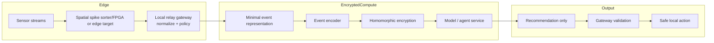
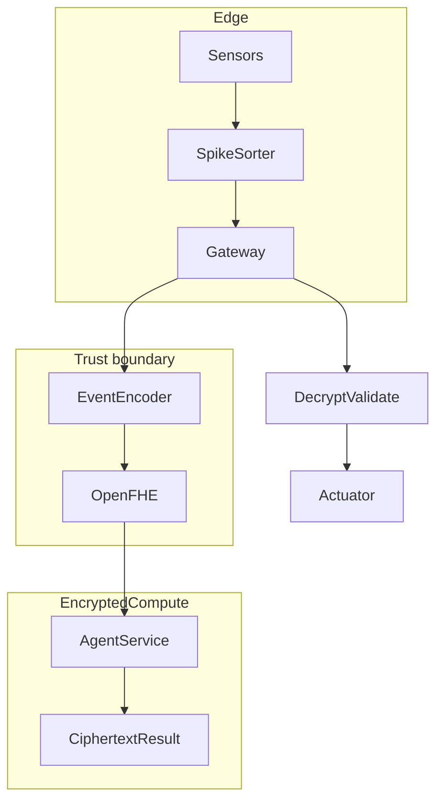

# 11 — Architecture visuals

## Pipeline (edge → encrypted relay → inference)

Only sparse event summaries cross the trust boundary; raw sensor payloads stay local.



## Encrypted inference flow (sequence)

```mermaid
sequenceDiagram
  participant Edge as Edge (sensor + spike sorter)
  participant Relay as Relay gateway
  participant Encode as Encoder
  participant Encrypt as OpenFHE encryptor
  participant Compute as Encrypted compute
  participant Validate as Gateway validation
  participant Act as Local action

  Edge->>Relay: sparse spike events
  Relay->>Encode: normalized events
  Encode->>Encrypt: minimal representation
  Encrypt->>Compute: ciphertext (public key)
  Compute-->>Encrypt: ciphertext result
  Encrypt->>Validate: ciphertext result
  Validate->>Act: safe recommendation/action
  Note over Relay,Validate: Private key stays local; policy gates decisions
```

## Latent embedding visualization (concept)

```mermaid
flowchart LR
  EVT[Event stream]
  ENC[Encoder]
  Z[(Latent embedding)]
  CL1[Cluster A (normal patterns)]
  CL2[Cluster B (anomaly boundary)]
  TOPK[Top-k neighbors / retrieval]
  DECISION[Policy + model head]

  EVT-->ENC-->Z-->TOPK-->DECISION
  Z-->CL1
  Z-->CL2
```

## Edge ↔ encrypted relay ↔ inference architecture


