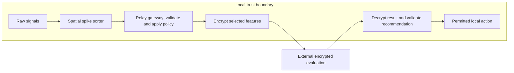

# NeuroFHE Relay

A CC0 research-alpha repository for privacy-preserving event intelligence.
NeuroFHE Relay explores how sparse event processing and homomorphic encryption
can work together: process sensitive signals locally, encrypt selected features,
and evaluate them without exposing their plaintext values to the compute service.

The repository includes a runnable JavaScript scaffold, native OpenFHE and TFHE-rs
comparison lanes, reproducible evidence artifacts, and an FPGA relay reference design.
**Research alpha:** the software and hardware require further integration and
validation before deployment. `productionClaim: false` and
`releaseGateSatisfied: false` remain the current evidence posture.

[Documentation](docs/README.md) · [Evidence dashboard](docs/evidence-dashboard.md) ·
[Hardware reference design](patent/complete-design-2026-09-05/README.md) ·
[Roadmap](docs/status-roadmap.md)

## Choose Your Path

| Your goal | Start here |
| --- | --- |
| **Curious** — understand the project without a technical background | [Plain-English quickstart](docs/layperson-quickstart.md) |
| **Reviewing** — assess the architecture, evidence, or research scope | [Reviewer quickstart](docs/reviewer-quickstart.md) |
| **Building** — run the scaffold or contribute | [Developer quickstart](docs/developer-quickstart.md) |

For a visual introduction, open the [browser briefing](index.html) locally.
The [demo walkthrough](docs/what-the-demo-shows.md) explains the output in plain English.

## Quick Commands

Use **Node.js 22** for parity with CI; Node.js 20 or newer is supported.
The portable JavaScript harness has no npm dependencies.

```sh
git clone https://github.com/AlexanderDaly/neurofhe-relay.git
cd neurofhe-relay
npm run demo
npm run gateway:demo
npm run ci
```

The first demo runs an educational sparse scorer using toy additive encryption.
The gateway demo exercises event validation, export policy, and local recommendation
handling. Neither requires native FHE libraries or a connected device.

| Task | Command |
| --- | --- |
| Run tests, metadata checks, documentation checks, and the hygiene scan | `npm run ci` |
| Check whitespace before committing | `git diff --check` |
| Publish a synthetic benchmark to a local output directory | `npm run benchmark:artifact -- --out tmp/benchmark-artifacts` |
| Inspect native library availability and evidence | `npm run native:doctor` |
| Generate a release-evidence dashboard artifact | `npm run release:evidence -- --artifact` |

See the [command reference](docs/command-reference.md) for artifact options and
native workflows, and [troubleshooting](docs/troubleshooting.md) for setup failures.
Generating a dashboard does not satisfy the [release gate](RELEASE.md).

## Architecture

The design separates local signal processing from encrypted evaluation.
Sparse representations reduce the input to selected scoring workloads; native
homomorphic-encryption libraries provide the encrypted compute paths.



The local gateway controls which representations may leave the device. Raw
payloads stay local by design; approved exports can include encrypted features,
aggregated metadata, or explicitly permitted plaintext fields. Encryption alone
does not hide all metadata, so artifacts record the applicable `privacyBoundary`
and `cryptoInventory`.

The runnable research-alpha scaffold demonstrates:

- **Event encoding:** `rawNeuralFrame -> spatialSpikeSorter -> eventWindow`,
  with integer operations suitable for an FPGA or edge implementation.
- **Gateway policy:** validation of raw and pre-sorted inputs, provenance,
  sanitization, and explicit plaintext, encrypted, aggregated, or withheld fields.
- **Sparse scoring:** a fixed linear model, `scores = W x + bias`, with
  comparable dense, unsorted-spike, and spatial-sorted representations.
- **Recommendation handling:** validation of permitted local reversible actions,
  rejection of raw device commands, and sanitized audit records.

See the [architecture decisions](docs/architecture-decisions.md) and
[prototype map](docs/prototype-map.md) for implementation details.

## Current Status

The project distinguishes portable demonstrations, native-library measurements,
and hardware design verification. Each supports a different level of evidence.

| Status Item | Current Posture | Confirm In |
| --- | --- | --- |
| Research-alpha release target | `v0.1.0-research-alpha`; release readiness remains gated. | [Release requirements](RELEASE.md), [roadmap](docs/status-roadmap.md) |
| Portable validation | Locally recorded with 143 passing tests; verify hosted checks on the current commit. | [Validation record](VALIDATION.md) |
| Merge state | Check the relevant PR; merges are governed by repository ruleset/admin policy as well as validation results. | [Operations runbook](docs/operations-runbook.md) |
| Release gate | `releaseGateSatisfied: false`; the evidence dashboard is not release approval. | [Release evidence](benchmark-artifacts/release-evidence/latest.json), [gate matrix](docs/release-gate-matrix.md) |
| Claim boundary | `productionClaim: false`; preserve the documented privacy and cryptographic boundaries. | [Evidence guide](docs/evidence-guide.md) |

### Evidence available

Committed artifacts cover derived UCI EEG Eye State plaintext baselines, sampled
public N-MNIST plaintext baselines, synthetic reconstruction-risk probes,
metadata-padding comparisons, and native OpenFHE and TFHE-rs runs or structured
blocker reports. Native results are specific to their recorded inputs, parameters,
and host environments.

Use the [evidence dashboard](docs/evidence-dashboard.md) for a summary, the
[artifact index](benchmark-artifacts/README.md) for source records, and the
[claim-evidence ledger](docs/claim-evidence-ledger.md) to assess what each result
supports. These artifacts do not establish production security, clinical validity,
or general performance guarantees.

### Hardware reference design

The [ENER reference design](patent/complete-design-2026-09-05/README.md) connects
an existing acquisition device to a Raspberry Pi host and an iCE40UP5K FPGA
mezzanine. It includes 16 patent architecture figures, eight circuit sheets,
a 55-component bill of materials, and the FPGA encoder implementation.

Simulation and routed timing pass at the 16 MHz target. The board has not been
assembled; native KiCad ERC, physical electrical testing, and headset-specific
integration remain outstanding. The package contains no PCB layout or Gerbers.

[Download the complete design package](output/ENER_Complete_Schematic_Design_B_2026-09-05.zip)

## Repository Layout

| Path | Purpose |
| --- | --- |
| [docs/](docs/README.md) | Architecture, quickstarts, research status, and operational guidance. |
| [prototype/](prototype/README.md) | Portable scaffold code, test suite, artifact publishers, and native lane adapters. |
| [benchmark-artifacts/](benchmark-artifacts/README.md) | Derived measurements, provenance, blocker reports, and evidence dashboards. |
| [patent/](patent/) | ENER drafting materials, architecture drawings, and reference-design sources. |
| [output/](output/) | Reference-design PDFs and the editable handoff archive. |
| [.github/](.github/) | CI workflows, contribution templates, and dependency-update configuration. |
| Root policy files | Contribution, security, maintenance, release, and CC0/public-domain guidance. |

See the [package manifest](PACKAGE_MANIFEST.md) for the detailed inventory.

## First Paths

| Role | Primary reference | Supporting guidance |
| --- | --- | --- |
| New reviewer | [Reviewer quickstart](docs/reviewer-quickstart.md) | [FAQ](docs/faq.md), [changelog](CHANGELOG.md) |
| Contributor | [Contributing](CONTRIBUTING.md) | [Developer quickstart](docs/developer-quickstart.md), [command reference](docs/command-reference.md) |
| Maintainer | [Maintainer responsibilities](MAINTAINERS.md) | [Review checklist](docs/maintainer-checklist.md), [operations runbook](docs/operations-runbook.md) |
| Evidence reviewer | [Evidence guide](docs/evidence-guide.md) | [Claim-evidence ledger](docs/claim-evidence-ledger.md), [release gates](docs/release-gate-matrix.md) |

## Scaffold Boundary

The JavaScript scaffold is a portable contract harness for demos, schema checks,
artifact generation, and orchestration. Its toy arithmetic is educational and
cannot substitute for native FHE measurements. Performance-sensitive execution
belongs in native libraries, systems code, or hardware implementations; see the
[native performance track](10-native-performance-track.md).

Post-quantum transport, identity, and artifact integrity are design directions,
not implemented security guarantees. Cryptographic agility requires explicit
library choices, parameters, implementation review, and side-channel analysis.

## Contributing

Contributions to reproducibility, documentation, native adapters, and validation
are welcome. Follow [CONTRIBUTING.md](CONTRIBUTING.md), run `npm run ci` and
`git diff --check`, and describe the evidence and limitations of your change.
Keep raw datasets and sensitive payloads outside git; commit derived artifacts
with provenance or structured blocker reports.

Use [Support](SUPPORT.md) for questions and issue routing, and the
[security policy](SECURITY.md) to report sensitive findings.

## License

Released under [CC0 1.0 Universal](LICENSE). The reference material is intended
to be freely studied, copied, modified, and shared. See the
[public-domain notice](PUBLIC_DOMAIN_NOTICE.md) for details.
