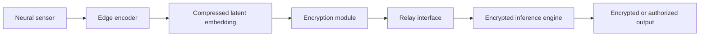
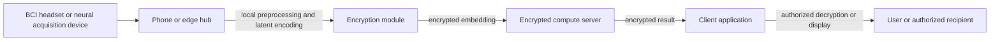
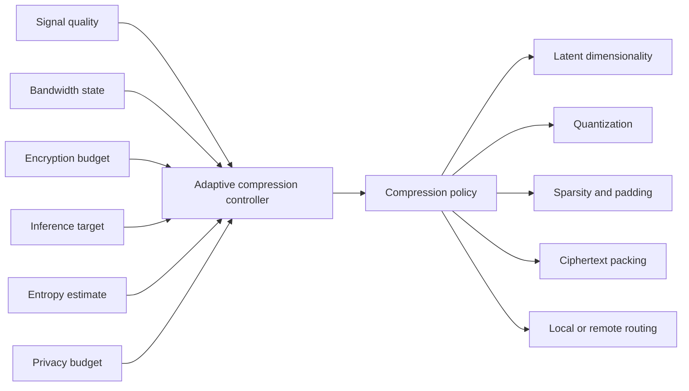
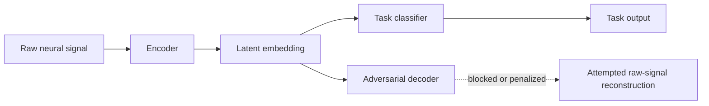
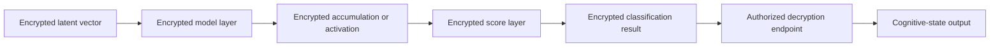
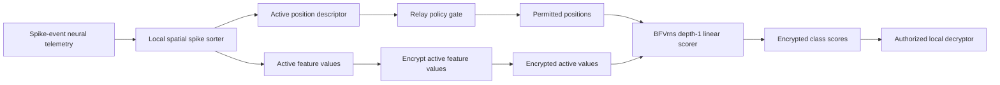

# ENER Drawings and Figure Descriptions

Title: Encrypted Neural Embedding Relay for Privacy-Preserving Neuroinference

This document provides simple architecture diagrams and patent-style descriptions for the provisional application. The Mermaid source files are stored in `patent/figures/` and mirrored in `patent/ENER_figures/`.

## Figure 1 - Overall ENER Pipeline

Figure 1 illustrates an end-to-end encrypted neural embedding relay pipeline. Neural telemetry is acquired by a neural sensor and provided to an edge encoder located within a trusted local boundary. The edge encoder converts raw or preprocessed telemetry into a compressed latent embedding. The compressed latent embedding is encrypted before transmission through a relay interface. An encrypted inference engine performs selected inference operations over the encrypted latent representation and returns an encrypted result or an authorized output. Raw neural telemetry is not exposed to the remote inference engine.

## Figure 2 - Split-Device Architecture

Figure 2 illustrates a split-device architecture. A BCI headset, implanted-device controller, wearable sensor, or other neural acquisition device provides telemetry to a phone, local hub, or edge processor. The phone or edge hub performs preprocessing, segmentation, latent encoding, adaptive compression, encryption, and policy checks. An encrypted compute server receives encrypted embeddings and computes inference results without receiving raw neural telemetry. A client application receives the encrypted result and decrypts or displays the result only when authorized.

## Figure 3 - Adaptive Latent Compression Controller

Figure 3 illustrates an adaptive latent compression controller. The controller receives signal-quality information, bandwidth state, encryption-budget information, inference target, entropy estimate, and privacy-budget constraints. Based on these inputs, the controller outputs a compression policy that may control latent dimensionality, quantization precision, sparsity, padding, ciphertext packing, and local or remote routing. The controller allows the system to balance task accuracy, reconstruction resistance, bandwidth use, and encrypted-compute cost.

## Figure 4 - Reconstruction-Resistant Encoder Training

Figure 4 illustrates reconstruction-resistant encoder training. A raw neural signal is provided to an encoder that generates a latent embedding. A task classifier is trained to predict a target output from the latent embedding. An adversarial decoder attempts to reconstruct the raw neural signal or sensitive attributes from the embedding. Training penalizes successful reconstruction while preserving task utility, thereby producing an embedding that is more resistant to raw-signal reconstruction or identity leakage.

## Figure 5 - Encrypted Cognitive-State Classifier

Figure 5 illustrates an encrypted cognitive-state classifier. An encrypted latent vector is provided to encrypted model layers that may include linear projections, polynomial activations, threshold logic, encrypted accumulation, encrypted lookup tables, or other privacy-preserving operations. The classifier produces an encrypted classification result, encrypted score vector, or encrypted confidence value. An authorized decryption endpoint decrypts or consumes the result and outputs a cognitive-state classification, motor-intent command, attention-state estimate, medical or neurodiagnostic label, or other authorized result.

## Figure 6 - Spatial Sparse-Event BFVrns Scorer

Figure 6 illustrates a preferred sorted sparse-event embodiment. Spike-event or event-derived neural telemetry is processed by a local spatial spike sorter within a trusted boundary. The sorter separates active position descriptors from active feature values. A relay policy gate determines whether active positions are public, padded, coarsened, encrypted, or withheld. Active feature values are encrypted before external transmission. A BFVrns depth-1 linear scorer computes encrypted class scores using the permitted positions and encrypted active values, and an authorized local decryptor decrypts or consumes the result.
