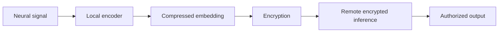

# Congressional Briefing Memo

## Encrypted Neural Embedding Relay (ENER): Privacy-Preserving Neural Computation Infrastructure

Date: May 2026
Prepared for: Congressional staff and technology-policy advisors
Purpose: Emerging-technology policy briefing

## Bottom Line

Neurotechnology is moving into assistive devices, clinical research, consumer wearables, and human-computer interaction systems. These systems can generate sensitive neural or neuro-adjacent data. Current privacy approaches often protect transmission and storage but still allow remote systems to process plaintext neural signals. ENER proposes a privacy-preserving architecture in which raw neural telemetry is processed locally into compressed embeddings, encrypted, and then used for selected remote inference without exposing raw signals.

The policy significance is that ENER turns cognitive privacy from a promise of restraint into a technical design boundary. It is not a medical claim, not a surveillance system, and not a blockchain storage proposal. It is a computation architecture for minimizing neural data before external processing.

## The Issue

Neural data may not fit cleanly into existing privacy categories. In clinical contexts, it can intersect with health information rules. In consumer contexts, it may be collected outside traditional medical settings while still revealing sensitive biometric or cognitive-state information. Future neurotechnology systems may use these signals for assistive control, rehabilitation, attention-state support, gaming interfaces, research collaboration, or adaptive computing.

The key risk is plaintext remote processing. A system may encrypt a stream during transmission, decrypt it on a cloud server, run a model, log intermediate features, and retain data for later analytics. That pattern creates exposure through breaches, vendor access, internal misuse, secondary use, and model-training pipelines.

Policy developments are already moving toward neural-data protection. Colorado expanded privacy protections to include biological data, including neural data. California added neural data to sensitive personal information. UNESCO and OECD materials emphasize mental privacy, dignity, consent, oversight, and responsible neurotechnology. FDA guidance for implanted BCI devices also underscores that some applications may carry serious medical-device obligations [2]-[6].

## ENER in Plain Terms

ENER changes where the privacy boundary sits. Instead of sending raw neural telemetry to a remote inference system, the local device first converts a signal window into a smaller representation called a latent embedding. That embedding is designed for a bounded task, compressed to reduce unnecessary information, encrypted, and then sent to an external processor. The remote processor computes over encrypted data and returns an encrypted or authorized result.

The most important phrase is "minimize before encrypting." Homomorphic encryption and secure inference are expensive when applied to dense raw signals. They become more plausible when the input is a small, task-oriented representation.

## Why It Matters for Public Policy

ENER is relevant to civil liberties because it reduces unnecessary centralization of sensitive neural telemetry. It is relevant to medical innovation because secure remote inference may support collaboration without requiring raw signal transfer. It is relevant to AI governance because it provides a technical control for data minimization and privacy-preserving computation. It is relevant to national-security analysis because secure human-computer interaction will require strong safeguards before deployment in high-consequence settings.

ENER also provides a standards opportunity. Policymakers and standards bodies could encourage privacy boundary manifests, cryptographic inventories, reconstruction-risk testing, metadata-leakage reporting, and local-first neural processing practices.

## Risks and Limitations

ENER does not solve every governance issue. Local devices can still be compromised. Embeddings can leak information if poorly designed. Metadata such as timing, session length, active channels, and confidence scores may reveal sensitive patterns. Homomorphic encryption is still computationally costly. Clinical or assistive applications require validation, safety engineering, accessibility review, and possibly FDA oversight.

The architecture should therefore be treated as one layer in a broader governance system. It can reduce exposure, but it cannot replace consent, regulation, cybersecurity, procurement safeguards, or human-rights review.

## Policy Questions for Staff

| Question | Why It Matters |
|---|---|
| Should neural telemetry receive special treatment in privacy law? | Existing categories may not capture inference risk and biometric sensitivity. |
| Should procurement require local-first processing or encrypted inference for neurotechnology? | Technical controls can reduce reliance on vendor promises. |
| Should workplace or educational neurotechnology face heightened restrictions? | Consent may be constrained in these settings. |
| Should standards bodies define neural privacy manifests and reconstruction-risk tests? | Interoperable safeguards may be needed before scale. |
| Should federal agencies fund privacy-preserving neurotechnology infrastructure? | Secure assistive and medical uses may serve public-interest goals. |

## Recommended Framing

ENER should be framed as privacy-preserving neural computation infrastructure. It should not be framed as generalized cognition decoding, behavioral surveillance, blockchain access control, or a clinical product. The responsible policy posture is to support secure assistive, medical, and research use while guarding against coercive or high-risk monitoring.
