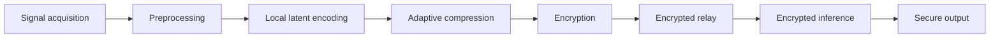
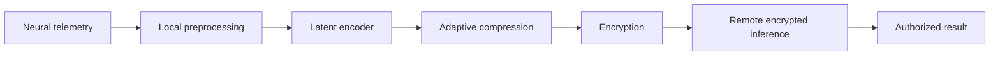
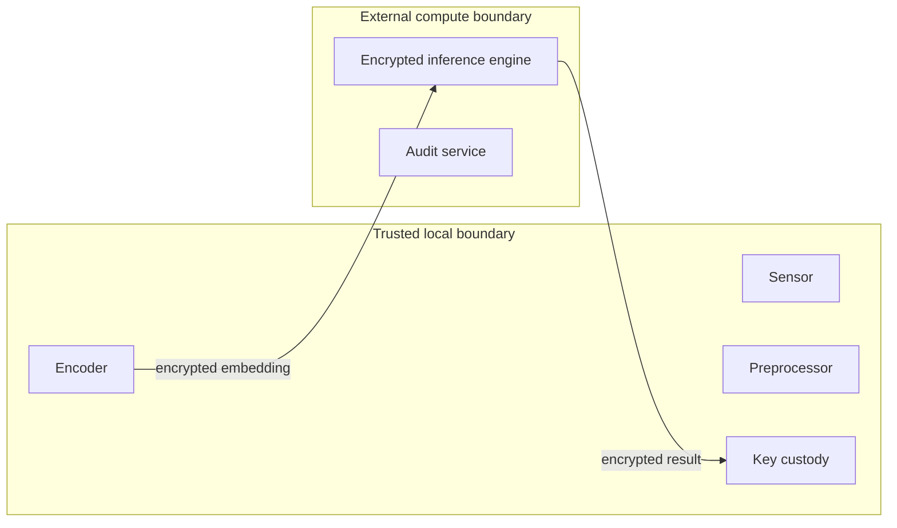
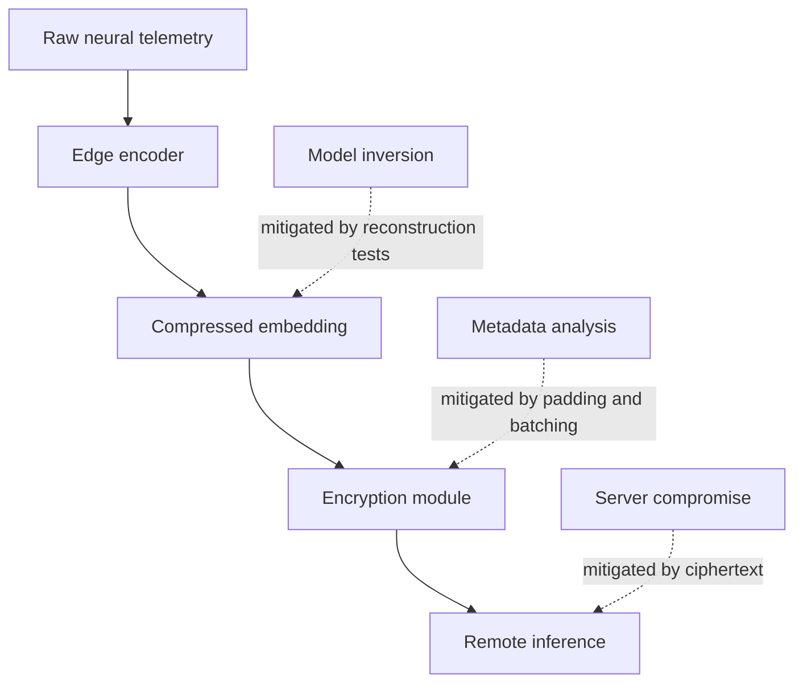

# Encrypted Neural Embedding Relay (ENER)

## A Privacy-Preserving Architecture for Secure Neuroinference

Technical & Policy Briefing
Prepared by: [Author Name / Organization]
Date: May 2026

This document is a research and policy discussion draft and does not constitute medical, legal, or regulatory guidance.

## Executive Summary

Neurotechnology is moving from research settings into assistive devices, clinical interfaces, consumer wearables, human-computer interaction systems, and distributed research infrastructure. Many of these systems acquire neural or neuro-adjacent signals that may support useful inferences about motor intent, attention, fatigue, workload, impairment, or interface control. The policy challenge is not only whether such data are collected, but where they are processed, how much raw signal leaves the user environment, and whether remote infrastructure can perform useful computation without seeing plaintext neural telemetry.

Encrypted Neural Embedding Relay, or ENER, is a proposed architecture for privacy-preserving neural computation infrastructure. Its central design choice is to process neural telemetry locally into compressed latent embeddings before encryption, then perform selected inference on encrypted embeddings rather than on raw neural signals. In practical terms, a headset, implant controller, mobile phone, clinical workstation, or local edge hub performs the first-stage signal processing. Only a task-oriented, minimized representation is encrypted and relayed to an inference service.

This approach addresses a limitation in many conventional privacy models. Encryption in transit and at rest can protect a file or network channel, but it does not protect the individual when a remote system decrypts neural data for computation. A cloud-hosted classifier, research analytics service, or model endpoint that receives plaintext neural features remains a point of exposure. The ENER architecture shifts the privacy boundary earlier in the pipeline: raw telemetry remains within a trusted local environment where feasible, and external processors receive ciphertext or protected shares.

The technical rationale is also computational. Fully homomorphic encryption and related privacy-preserving computation methods remain expensive, particularly when applied to dense, high-dimensional time-series signals. Raw EEG, ECoG, fNIRS, MEG, and implanted-array telemetry can contain many channels, high sample rates, noise, artifacts, and task-irrelevant information. ENER reduces the encrypted workload by converting raw windows into compact latent representations designed for the target task. Compression before encryption can reduce bandwidth, ciphertext expansion, memory pressure, and homomorphic operation counts.

Latent-space neuroprocessing changes the privacy and feasibility equation. A well-designed embedding can preserve enough information for a bounded inference task while discarding or suppressing information that is not required. The embedding may be quantized, sparsified, packed into ciphertext slots, or shaped for a specific encrypted classifier. The architecture can also use reconstruction-resistant training, adversarial testing, metadata controls, differential privacy for aggregate learning, and adaptive compression policies tied to signal quality, encryption cost, bandwidth, entropy, and task type.

ENER should not be presented as a general-purpose solution to every neurotechnology privacy problem. It does not eliminate all metadata leakage. It does not remove the need for device security, informed consent, clinical validation, accessibility review, or governance. It also does not claim that every neural computation can be efficiently run under homomorphic encryption today. Its value is more specific: it provides a disciplined systems architecture for keeping raw neural telemetry local while allowing selected remote computation over minimized, encrypted representations.

The public-interest rationale is straightforward. Neural telemetry may be treated as health information in some settings, biometric or sensitive personal information in others, and emerging neuro-rights material in policy debates. HHS, FDA, NIST, UNESCO, OECD, Colorado, and California materials all point toward a broader governance trend: systems that process sensitive biological or neural data should be built with privacy, security, oversight, and use limitation in mind [1]-[8]. ENER is an engineering response to that direction of travel. It converts privacy from a downstream contractual promise into an upstream computation boundary.

## 1. Technical Background

Neural telemetry refers to signals generated by measuring activity of the central or peripheral nervous system. Common modalities include electroencephalography (EEG), electrocorticography (ECoG), functional near-infrared spectroscopy (fNIRS), magnetoencephalography (MEG), implanted microelectrode arrays, local field potentials, spike events, and wearable BCI-derived signals. These signals are typically segmented into time windows, cleaned for artifacts, transformed into features, and passed to a model that estimates a bounded state or command.

An embedding is a compact representation of a larger input. In machine learning, embeddings are often used because raw inputs may be too large, noisy, or task-irrelevant for efficient processing. A neural embedding may represent a window of signal activity as a vector, tensor, sparse event list, low-bit code, or packed feature set. Latent representations are not inherently private. They can still leak information if they preserve too much detail or if an attacker trains a decoder to reconstruct the source signal. The privacy value depends on how the embedding is designed, constrained, and tested.

Edge AI processing moves the first stages of computation closer to the data source. In ENER, edge processing may occur in a headset, implant controller, phone, local server, clinical workstation, or secure enclave. The purpose is not merely latency reduction. It is to keep raw telemetry under local control and transform it before any remote computation takes place.

Homomorphic encryption allows selected operations over encrypted data. Leveled or somewhat homomorphic encryption can support bounded-depth computations, while fully homomorphic encryption can in principle support broader computation at higher cost. Schemes such as BFV, BGV, CKKS, and TFHE-style systems support different arithmetic models and accuracy tradeoffs [9], [10]. For neural inference, the practical question is not whether encrypted computation is theoretically possible, but whether the representation and model are small enough for useful latency, cost, and power constraints.

Secure inference is a broader category. It may use homomorphic encryption, secure multiparty computation, trusted execution environments, secure enclaves, differential privacy, secure aggregation, or hybrid designs. Federated learning can keep some training local, while secure aggregation and differential privacy can reduce leakage from model updates. ENER is compatible with these methods but is centered on a simpler architectural principle: minimize and encrypt the neural representation before external processing.

## 2. Problem Statement

Raw neural telemetry creates a distinctive privacy problem because it can be continuous, individualized, context-rich, and difficult for users to interpret. In clinical settings, it may intersect with health information obligations. In consumer settings, it may fall outside traditional medical workflows while still carrying biometric or cognitive-state relevance. In workplace, educational, gaming, research, or assistive contexts, the same signal may carry different consent and power-balance concerns.

Existing encrypted EEG and biomedical-signal approaches often protect storage or transmission. Those protections are useful, but they do not solve the computation problem. If a remote service decrypts signal windows or high-dimensional features for inference, the service still becomes a sensitive data processor. That design creates exposure through server compromise, internal access, logs, model training pipelines, analytics integrations, vendor transfers, and later secondary uses.

The risks include biometric leakage, because neural patterns may be individualized; model inversion, because learned representations can sometimes be mapped back toward source features; and centralized accumulation, because large databases of neural telemetry could become valuable for uses beyond the original purpose. These concerns are aligned with broader AI governance trends that emphasize data minimization, privacy-by-design, accountability, and technical safeguards [7], [8].

Policy developments reinforce the need for earlier privacy boundaries. HIPAA-style safeguards focus attention on confidentiality, integrity, and availability of electronic protected health information in covered settings [1]. FDA guidance for implanted BCI devices underscores that some neurotechnology products may raise serious medical-device considerations [2]. Colorado and California have moved to address neural data within broader privacy law frameworks [3], [4]. UNESCO and OECD materials identify mental privacy, dignity, consent, safety, and responsible innovation as central neurotechnology governance issues [5], [6].

ENER is designed for this environment. It does not depend on broad claims about future neurotechnology. It addresses a concrete systems question: how can useful neuroinference be supported while reducing the need to expose raw neural telemetry to remote infrastructure?

## 3. ENER Architecture

ENER uses a split pipeline:

The acquisition layer receives neural telemetry from a sensor or device. Preprocessing handles filtering, artifact rejection, windowing, normalization, channel selection, and quality scoring. The latent encoder converts each window into a compact task-oriented representation. The adaptive compression controller selects dimensionality, quantization, sparsity, padding, packing, or local-versus-remote routing based on practical constraints. The encryption module protects the compressed embedding before it leaves the local boundary. The relay moves ciphertext and permitted metadata to an inference engine, which produces encrypted scores, an authorized result, or a policy-controlled output.

The architectural distinction is compression before encryption. A dense raw signal can be expensive to encrypt and inefficient to evaluate under homomorphic operations. A compressed embedding can be smaller, lower precision, and better aligned with the mathematical operations supported by encrypted inference. For example, a sparse event representation or low-bit latent vector can reduce ciphertext slots, multiplications, rotations, and network payload size. The repo's current research-alpha package demonstrates a narrow sparse linear-score contract, not production security, but it illustrates the relevant systems boundary: selected features cross the boundary under explicit cryptographic controls.

ENER also reduces attack surface by limiting what external systems receive. A remote processor does not need raw waveforms, full-resolution recordings, or high-dimensional plaintext features. It may receive encrypted latent values, public model metadata, public cryptographic parameters, and limited routing metadata. High-risk metadata, such as active event timing or channel positions, can be padded, coarsened, encrypted, or routed to local-only processing depending on the task.

## 4. Core Innovations

### 4.1 Compressed Latent Neurotransport

Compressed latent neurotransport is the movement of task-sufficient neural representations rather than raw telemetry. The technical value is efficiency and minimization. Latent vectors can be shaped for encrypted computation, transmitted with lower bandwidth, and evaluated under constrained arithmetic. The implementation rationale is straightforward: a privacy-preserving compute system should not carry more neural information than the task requires.

Strategically, this positions ENER away from crowded encrypted-record storage systems. The FTO extraction provided for this project suggests that blockchain-mediated encrypted storage and permissioned retrieval are heavily covered. ENER's stronger territory is inference-before-storage: local neural representation, encryption, and protected computation.

### 4.2 Reconstruction-Resistant Embeddings

An embedding is only privacy-preserving if it is difficult to use for unauthorized reconstruction or re-identification. ENER therefore treats reconstruction resistance as a design objective, not an assumption. Encoder training may include bottlenecks, quantization, sparsity constraints, adversarial decoders, identity-obfuscation losses, mutual-information penalties, and tests for reconstruction error.

The strategic implication is important for civil-liberties and medical stakeholders. ENER is not merely an encryption wrapper around sensitive features. It seeks to reduce the sensitive content of the feature itself before external computation.

### 4.3 Split-Device Inference

ENER separates acquisition, encoding, encryption, inference, and output authorization across trust zones. A local device handles raw telemetry and key custody. A remote processor handles encrypted inference. An authorized endpoint handles decryption or result consumption. This structure is compatible with consumer devices, clinical workstations, local hospital servers, cloud inference services, and research environments.

The implementation rationale is resilience. A compromise of the remote inference engine should not automatically disclose raw neural telemetry. A compromise of the local device remains serious, but the architecture makes clear where the most sensitive controls must reside.

### 4.4 Adaptive Encryption-Aware Compression

Encrypted computation has measurable costs: ciphertext size, multiplicative depth, rotations, bootstrapping, memory, latency, and energy. ENER's adaptive controller selects compression parameters using those costs alongside signal quality, bandwidth, entropy, task type, and privacy budget. A low-latency assistive-control task may require a shallow encrypted model or local fallback. A research batch task may tolerate stronger padding and slower aggregation.

This is a systems-level innovation because compression is not treated as a fixed preprocessing step. It becomes a policy-aware control surface for privacy, compute, and reliability.

### 4.5 Encrypted Cognitive-State Classification

ENER can support bounded cognitive-state or control-state classification without exposing plaintext neural embeddings to the inference service. Examples include motor-intent classification, workload estimation, attention-state support, rehabilitation signals, or assistive interface commands. The public language should remain bounded: these are task-specific inferences from measured signals, not generalized cognition decoding.

The implementation path begins with linear or low-depth models and expands only where benchmarks justify the added complexity. This conservative sequencing keeps ENER within feasible encrypted-inference engineering rather than speculative artificial intelligence claims.

### 4.6 Federated Encrypted Neurolearning

ENER may support federated learning or multi-site research workflows where local devices compute embeddings or model updates and aggregate them under secure protocols. Secure aggregation and differential privacy can reduce leakage from updates, while encrypted inference can protect individual sessions. This is particularly relevant to research institutions and clinical collaborations that need multi-party learning without unnecessary centralization of raw neural telemetry.

## 5. Security and Privacy Analysis

ENER should be evaluated against realistic attack surfaces. The remote compute provider may be compromised or may contain internal logging systems that are not appropriate for raw neural data. Model operators may attempt secondary use. Attackers may try model inversion, reconstruction from embeddings, membership inference, or traffic analysis. Edge devices may be lost, compromised, or misconfigured. Cryptographic implementations may suffer parameter mistakes, side-channel leakage, key-management failures, or unsafe fallback modes.

The architecture mitigates some of these risks by minimizing before encrypting, maintaining key custody at authorized endpoints, separating trust zones, and using encrypted inference for remote computation. Reconstruction-resistant encoders reduce the value of any embedding that is later exposed. Metadata controls can reduce leakage from timing, sparsity, session length, active channels, or confidence scores. Audit records can document which encoder, compression policy, cryptographic scheme, and inference target were used without retaining raw signal data.

The limitations are equally important. ENER does not make neural telemetry risk-free. Latent embeddings may still carry sensitive information. Homomorphic encryption protects values during computation but may not hide all metadata. Trusted execution environments depend on hardware and side-channel assumptions. Differential privacy is more suitable for aggregate release than individual inference streams. Federated learning can leak through model updates if not designed carefully. Local devices remain high-value targets because they see raw signals before encoding.

ENER should therefore be deployed as part of a layered privacy program: device hardening, secure key custody, explicit retention limits, careful logging, independent security review, policy controls, user-facing transparency, and task-specific validation. The architecture supplies a privacy-preserving computation layer, not a complete governance system by itself.

## 6. Regulatory and Policy Implications

ENER fits a broader shift toward privacy-preserving neurotechnology standards. It provides a concrete technical pattern for cognitive privacy: sensitive neural telemetry should be processed locally where feasible, minimized into task-specific representations, and protected during external computation. This pattern is consistent with privacy engineering, data minimization, and AI risk-management principles.

Medical-device implications require careful handling. If ENER is integrated into diagnosis, treatment, implantable BCI devices, assistive control systems, or clinical decision support, FDA pathways, clinical validation, human factors, cybersecurity, quality systems, and post-market monitoring may become relevant. The architecture should not be marketed as a medical device or clinical solution without modality-specific validation and regulatory review.

Civil-liberties implications are also central. Neural telemetry can be collected in settings where consent may be constrained, such as employment, education, institutional care, or defense-adjacent environments. ENER cannot resolve coercion or misuse on its own, but it can reduce ambient data exposure and make privacy controls technically enforceable. A policy framework should distinguish voluntary assistive use from monitoring systems that could affect employment, benefits, discipline, insurance, or access to services.

Military and national-security contexts deserve sober treatment. Privacy-preserving neural computation may be relevant to rehabilitation, operator safety, secure human-machine interaction, and protected medical research. At the same time, use in coercive, surveillance, or performance-monitoring contexts would raise significant ethical concerns. Standards work should therefore include civil-liberties organizations, disability advocates, clinicians, security engineers, and affected users.

## 7. Commercial and Public-Interest Applications

ENER's most defensible applications are those where privacy and utility are aligned. Assistive neurotechnology and disability interfaces can benefit from remote model updates or specialized inference without requiring raw signal centralization. Rehabilitation systems can process task-specific neural features while reducing unnecessary exposure. Secure medical diagnostics and telemedicine neuroanalytics may use encrypted inference to support collaboration across institutions, subject to clinical validation and regulatory requirements.

Consumer applications should be approached cautiously. Privacy-safe gaming, adaptive computing, and human-computer interaction may be legitimate if participation is voluntary, data minimization is real, and outputs are bounded. The architecture is particularly useful where application developers need an interface signal but should not receive raw telemetry.

Research institutions may use ENER-style infrastructure to collaborate across datasets while reducing the transfer of raw participant data. Multi-site studies could compare encrypted embeddings, aggregate metrics, or model updates under a common representation contract. This does not replace institutional review, consent, or data-use agreements, but it can reduce technical exposure.

## 8. Intellectual Property Strategy

The strongest IP framing is "foundational cognitive privacy infrastructure" implemented as privacy-preserving neural computation infrastructure. The provisional strategy should preserve families around local latent neural encoding, compression before encryption, encrypted inference over compressed neural embeddings, adaptive encryption-aware compression, reconstruction-resistant embeddings, and split-device trust zones.

The FTO extraction suggests avoiding claim language centered on blockchain storage, smart-contract access, permissioned retrieval, or encrypted medical records. Those areas appear crowded and may create unnecessary examination or commercialization friction. If distributed infrastructure is mentioned, it should be subordinate to the protected inference architecture rather than the inventive center.

Potential patent-family structure:

| Family | Core Concept | Commercial Relevance |
|---|---|---|
| Latent neural relay | Local embedding generation and encrypted transport | Interfaces, SDKs, device middleware |
| Adaptive compression | Policy-driven latent shaping for encrypted inference | Performance optimization, edge deployment |
| Reconstruction resistance | Encoder training and certification against reconstruction | Trust, compliance, clinical adoption |
| Encrypted classifiers | Homomorphic or secure inference over neural embeddings | Cloud inference, telemedicine, research |
| Federated neurolearning | Secure multi-site learning over embeddings or updates | Research networks, model improvement |

Continuation opportunities may include modality-specific claims, encrypted model-weight protection, metadata-leakage controls, secure enclave hybrids, clinical-workflow integrations, and standards-essential representation contracts. Licensing strategy should favor interoperability: reference encoders, privacy boundary manifests, cryptographic inventories, and conformance tests could support standards-related positioning without forcing a closed ecosystem.

## 9. Technical Feasibility Roadmap

ENER should proceed through conservative, evidence-driven phases.

| Phase | Goal | Outputs | Main Risk |
|---|---|---|---|
| Phase I: Software simulation | Validate representation contracts and encrypted linear inference on synthetic or public datasets. | Benchmarks, threat model, reconstruction tests, privacy manifest. | Toy results may not generalize to real neural telemetry. |
| Phase II: Edge-device prototype | Run local preprocessing, embedding, and encryption on a phone, headset hub, or workstation. | Latency, battery, bandwidth, and robustness metrics. | Edge hardware may constrain encryption and model size. |
| Phase III: Encrypted inference optimization | Compare BFV/BGV, CKKS, TFHE, MPC, TEE, and hybrid paths for bounded tasks. | Operation counts, accuracy tradeoffs, parameter reports. | Cryptographic cost may limit task complexity. |
| Phase IV: Pilot integrations | Integrate with assistive, research, or clinical-adjacent workflows under review. | User workflow data, security review, compliance mapping. | Governance and validation requirements may dominate engineering. |

The immediate technical target should remain modest: encrypted linear or shallow inference over compressed embeddings, with explicit comparison against plaintext baselines and dense encrypted alternatives. A successful early result is not a broad neurotechnology claim. It is a measured demonstration that local latent compression can make protected inference more practical.

## 10. Conclusion

Neurotechnology will require privacy infrastructure before large-scale adoption can be trusted. Raw neural telemetry should not become routine cloud telemetry simply because remote inference is convenient. ENER offers a measured architecture for reducing that exposure: process locally, compress into task-specific latent representations, encrypt before relay, compute over protected embeddings, and return results only through authorized pathways.

The architecture is not a substitute for law, ethics, clinical validation, or institutional oversight. It is a technical layer that can make those commitments more credible. If developed carefully, ENER can support secure medical neurotechnology, assistive interfaces, encrypted human-computer interaction, and privacy-preserving research collaboration while respecting civil liberties and cognitive privacy.

## Appendix A: Glossary

| Term | Definition |
|---|---|
| Neural telemetry | Signals generated by measuring nervous-system activity, including EEG, ECoG, fNIRS, MEG, implanted-array signals, and related biosignals. |
| Latent embedding | A compact representation of a signal window generated by an encoder for a bounded task. |
| Homomorphic encryption | Cryptography that permits selected computation over encrypted data. |
| Secure inference | Machine-learning inference performed with technical protections that reduce exposure of inputs, models, outputs, or metadata. |
| Reconstruction resistance | Design and testing practices intended to reduce reconstruction of raw signals or sensitive attributes from embeddings. |
| Privacy budget | A control framework for acceptable leakage, dimensionality, noise, metadata exposure, and task utility. |

## Appendix B: Acronyms

| Acronym | Meaning |
|---|---|
| BCI | Brain-computer interface |
| BFV / BGV / CKKS / TFHE | Families of homomorphic-encryption schemes |
| DP | Differential privacy |
| EEG | Electroencephalography |
| ECoG | Electrocorticography |
| ENER | Encrypted Neural Embedding Relay |
| FHE | Fully homomorphic encryption |
| fNIRS | Functional near-infrared spectroscopy |
| MEG | Magnetoencephalography |
| MPC | Secure multiparty computation |
| TEE | Trusted execution environment |

## Appendix C: Architecture Diagrams

### Signal Flow

### Trust Zones

### Threat Model

## Appendix D: Claim Seeds for Counsel Review

The strongest claim seeds remain method, system, and computer-readable-medium families centered on local neural telemetry acquisition, local compressed latent embedding generation, encryption before relay, inference over encrypted embeddings, and output without exposing raw telemetry to the inference engine. Dependent concepts include adaptive latent dimensionality, reconstruction-resistant embeddings, identity-obfuscating embeddings, metadata padding, split-device inference, encrypted motor-intent or attention-state classification, multi-user encrypted batch inference, and federated encrypted neurolearning.

## Appendix E: References and Source Categories

[1] U.S. Department of Health and Human Services, "The Security Rule," HIPAA for Professionals, https://www.hhs.gov/hipaa/for-professionals/security/index.html.
[2] U.S. Food and Drug Administration, "Implanted Brain-Computer Interface (BCI) Devices for Patients with Paralysis or Amputation - Non-clinical Testing and Clinical Considerations," https://www.fda.gov/regulatory-information/search-fda-guidance-documents/implanted-brain-computer-interface-bci-devices-patients-paralysis-or-amputation-non-clinical-testing.
[3] Colorado General Assembly, HB24-1058, "Protect Privacy of Biological Data," https://leg.colorado.gov/bills/hb24-1058.
[4] California Legislative Information, SB-1223, "Consumer privacy: sensitive personal information: neural data," https://leginfo.legislature.ca.gov/faces/billNavClient.xhtml?bill_id=202320240SB1223.
[5] UNESCO, "Recommendation on the Ethics of Neurotechnology," https://www.unesco.org/en/legal-affairs/recommendation-ethics-neurotechnology.
[6] OECD, "Responsible Innovation," including responsible innovation in neurotechnology materials, https://www.oecd.org/en/topics/responsible-innovation.html.
[7] NIST, "Privacy Engineering" and NIST Privacy Framework materials, https://www.nist.gov/privacy-engineering.
[8] NIST, "AI Risk Management Framework," https://www.nist.gov/itl/ai-risk-management-framework.
[9] Foundational homomorphic-encryption literature, including fully homomorphic encryption and scheme-design work.
[10] Applied homomorphic-encryption scheme and library literature, including BFV, BGV, CKKS, TFHE-style systems, OpenFHE, Microsoft SEAL, Concrete, and related implementations.
[11] Federated learning, secure aggregation, and differential privacy literature.
[12] BCI privacy, neuroethics, model inversion, representation leakage, and secure inference literature.

## Appendix F: Suggested Standards Work

ENER would benefit from standards work on neural privacy boundary manifests, encrypted embedding representation contracts, reconstruction-risk reporting, metadata leakage scoring, cryptographic inventory formats, edge-device key custody, and conformance tests for privacy-preserving neuroinference systems.
