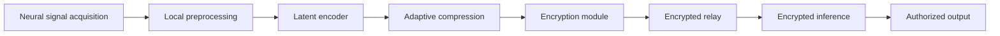
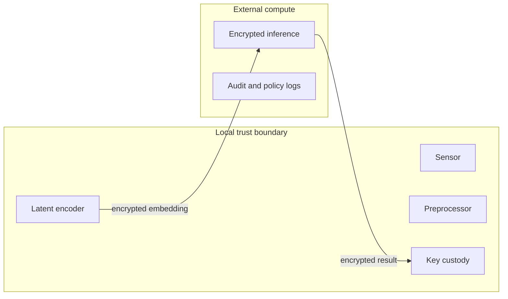
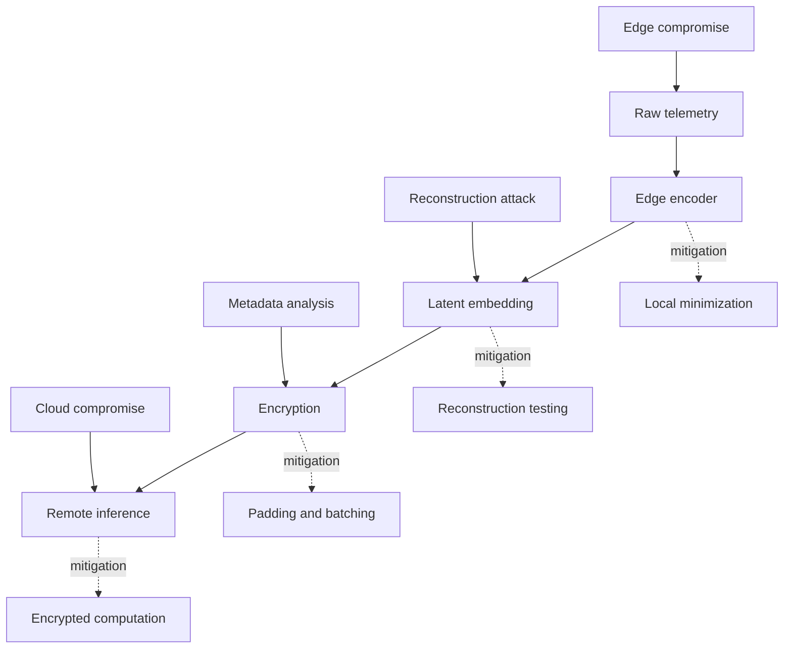

# ENER Visual Recommendations

The ENER visual system should be clean, monochrome-compatible, and suitable for congressional staff printouts, legal review packets, and investor diligence rooms. Avoid futuristic imagery, brain illustrations as decoration, surveillance motifs, dark threat aesthetics, or dramatic glowing-interface treatments.

## Recommended Diagrams

| Diagram | Purpose | Recommended Treatment |
|---|---|---|
| Architecture overview | Show the full ENER pipeline from acquisition to secure output. | Horizontal signal-flow chart with local and remote trust zones. |
| Edge/cloud split | Clarify which components see raw telemetry and which see ciphertext. | Two-zone diagram: trusted local boundary and external compute boundary. |
| Encryption pipeline | Explain compression before encryption. | Three-stage diagram: raw window, compressed embedding, encrypted inference input. |
| Adaptive controller | Show policy inputs and compression outputs. | Hub-and-spoke controller diagram with signal quality, bandwidth, encryption budget, entropy, task type, and privacy budget. |
| Threat model | Communicate honest limitations and mitigations. | Layered attack-surface diagram with edge compromise, cloud compromise, reconstruction risk, and metadata leakage. |
| Roadmap | Show conservative maturity path. | Four-phase timeline from simulation to pilot integrations. |

## Diagram Source: Architecture Overview

## Diagram Source: Trust Boundary

## Diagram Source: Threat Model

